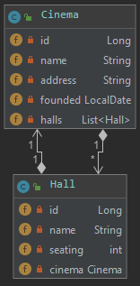

= Cinema - Mario Lengauer
:source-highlighter: coderay
:sourcedir: src/main/java/at/htl/cinema

== Übersicht
=== Klassendiagramm

=== ERD

== Erstellung des Projektes

[source]
----
mvn io.quarkus:quarkus-maven-plugin:1.0.0.CR1:create \
    -DprojectGroupId=at.htl \
    -DprojectArtifactId=cinema \
    -DclassName="at.htl.cinema.rest.cinema" \
    -Dpath="/cinema"
----

==== DB konfigurieren
in application.properties folgendes eintragen:
[source]
----
quarkus.datasource.url=jdbc:postgresql://192.168.99.100/postgres
quarkus.datasource.driver=org.postgresql.Driver
quarkus.datasource.username=postgres
quarkus.datasource.password=passme
quarkus.datasource.min-size=3
quarkus.datasource.max-size=13
quarkus.hibernate-orm.database.generation=drop-and-create
----

==== Entitäten erstellen
[source,java]
----
include::{sourcedir}/model/Cinema.java[lines=9..35;77..78]
----
==== 4. InitBean erstellen
[source, java]
----
include::{sourcedir}/business/InitBean.java[lines=17..41]
----
== Db im Docker Container Starten
[source]
----
docker run --name some-postgres -p 5432:5432 -e POSTGRES_PASSWORD=passme -d postgres
----

== Quarkus im Dev Mode starten:
[source]
----
mvnw compile quarkus:dev
----

== Swagger UI
Extension installieren
[source]
----
mvnw quarkus:add-extension -Dextensions="openapi"
----
Erreichbar unter

[source]
----
http://localhost:8080/swagger-ui/
----